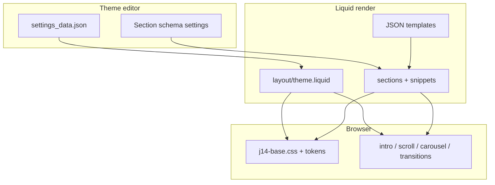

# Chapter 02 — Theme architecture

Official reference:
[Theme architecture](https://shopify.dev/docs/storefronts/themes/architecture)

## Directory map

```
fizz-july-14th-theme/
├── assets/          # CSS, JS, images, SVG masks, GSAP
├── config/          # settings_schema.json + settings_data.json
├── layout/          # theme.liquid, password.liquid
├── locales/         # en.default.json
├── sections/        # j14-* merchant sections + header-group.json
├── snippets/        # media, tokens, colorway helpers, cards
├── templates/       # JSON templates (index, product, …)
├── docs/            # This book (not deployed — see .shopifyignore)
├── design/          # Research report (not deployed)
├── preview/         # Isolated HTML labs (not deployed)
└── scripts/         # Metafield bootstrap (not deployed)
```

## Layers of responsibility



### Liquid (server / render time)

- Chooses which sections appear (`templates/*.json`).
- Reads `section.settings` / `block.settings` and product objects.
- Emits HTML, CSS variables, and `data-*` attributes for JS.
- **Cannot** parse arbitrary JSON files at runtime.

### Theme editor (merchant UI)

- Driven by `` in sections and `config/settings_schema.json`.
- Saving updates `settings_data.json` or template JSON.
- Does **not** scrub ScrollTrigger the way a visitor scroll does — so JS also
  listens for `shopify:section:load` / `shopify:block:select`.

### Browser runtime

- GSAP ScrollTrigger powers the intro scrub.
- `j14-scroll.js` handles mosaic / how-to without GSAP.
- Carousel and PDP gallery are vanilla JS.

## Layout shell

[`layout/theme.liquid`](../layout/theme.liquid) loads:

1. `j14-base.css`
2. `j14-theme-tokens` snippet (CSS custom properties)
3. Header group sections
4. `{{ content_for_layout }}`
5. Deferred scripts: GSAP → ScrollTrigger → intro → scroll → carousel →
   page transitions

`class="j14-no-motion"` is applied when Theme settings disable motion or when
JS detects `prefers-reduced-motion`.

## Naming convention

| Prefix | Meaning |
| --- | --- |
| `j14-` | July 14 theme component |
| `data-j14-*` | JS hooks |
| `--j14-*` | CSS custom properties |

## Section / block limits

From Shopify’s
[section schema](https://shopify.dev/docs/storefronts/themes/architecture/sections/section-schema):

- Max **50 blocks** per section (this theme lowers that with `max_blocks`).
- `limit: 1` on intro / how-to so only one scroll narrative exists.
- `enabled_on` / `disabled_on` keep intro on home and product section on PDPs.

Next: [Chapter 03 — Design system](03-design-system.md)
